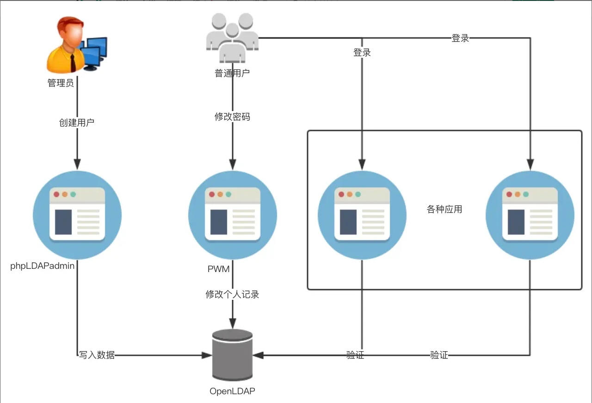

# LDAP
`Lightweight Direction Access Protocal`  
通过IP协议提供访问控制和维护分布式信息的目录信息。

**好处**  
可以这样讲：市面上只要你能够想像得到的所有工具软件，全部都支持LDAP协议。比如说你公司要安装一个项目管理工具，那么这个工具几乎必然支持LDAP协议，你公司要安装一个bug管理工具，这工具必然也支持LDAP协议，你公司要安装一套软件版本管理工具，这工具也必然支持LDAP协议。LDAP协议的好处就是你公司的所有员工在所有这些工具里共享同一套用户名和密码，来人的时候新增一个用户就能自动访问所有系统，走人的时候一键删除就取消了他对所有系统的访问权限，这就是LDAP。

   

**配置参考**  
https://segmentfault.com/a/1190000014683418

## docker使用openldap及其界面管理工具Phpldapadmin
1. 见 `LDMP/docker-compose.yaml`  
2. admin用户 `cn=admin,dc=libaigo,dc=com`  
3. Phpldapadmin使用参考: https://cloud.tencent.com/developer/article/1349446  
4. 在容器里查看此文件, 相关配置在里面，后面持久化可以容器挂载出来  `/etc/ldap/slapd.d/cn=config/olcDatabase={1}mdb.ldif`